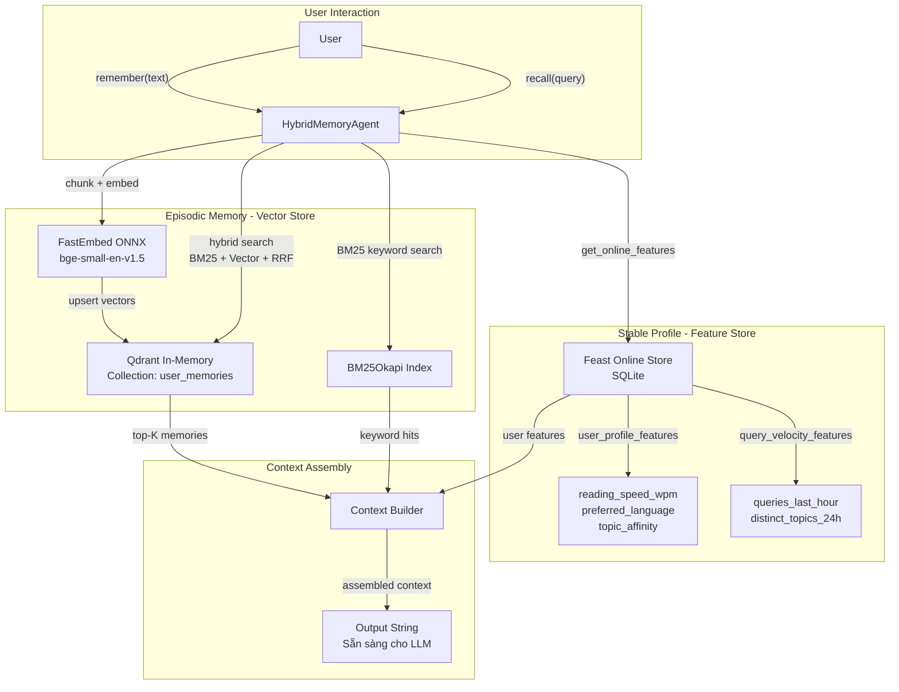

# Kiến trúc AI Assistant với Hybrid Memory cho Người dùng Việt Nam

**Contributor:** Nguyễn Tiến Huân

## 1. Tổng quan

Hệ thống này thiết kế một trợ lý AI cá nhân cho người dùng Việt Nam, kết hợp hai loại bộ nhớ:

- **Episodic Memory** (Vector Store — Qdrant): Lưu trữ và tìm kiếm các đoạn hội thoại, ghi chú, tài liệu mà người dùng đã tương tác. Dữ liệu này có tính chất *tăng liên tục* và cần tìm kiếm theo ngữ nghĩa.
- **Stable User Profile** (Feature Store — Feast): Lưu trữ các thuộc tính ổn định của người dùng (ngôn ngữ ưu tiên, tốc độ đọc, chủ đề quan tâm) và các tín hiệu hoạt động gần đây (số query trong 1 giờ, số topic đã truy vấn). Dữ liệu này có tính chất *tabular*, cần tra cứu nhanh ở mức millisecond.

Khi người dùng hỏi một câu, hệ thống thực hiện song song: (1) Hybrid Search trên episodic memory, (2) Online lookup trên Feature Store. Kết quả được kết hợp thành một context string phong phú, sẵn sàng đưa vào LLM để sinh câu trả lời cá nhân hoá.

## 2. Sơ đồ kiến trúc

**Data flow:** User gọi `remember()` → text được chunk theo câu → embed bằng FastEmbed → upsert vào Qdrant với payload `user_id` để isolate dữ liệu mỗi user. User gọi `recall()` → hybrid search (BM25 + vector + RRF k=60) trên Qdrant (filtered by user_id) + đồng thời lấy profile từ Feast → kết hợp thành context string.

## 3. Ba quyết định kiến trúc với tradeoff rõ ràng

### Quyết định 1: Chunking Strategy — Sentence-level chunking

**Lựa chọn đã xem xét:**
- **Option A — Per-message chunking** (mỗi tin nhắn = 1 chunk): Đơn giản, nhưng nếu tin nhắn dài (user paste cả tài liệu), vector embedding sẽ bị "pha loãng" — trung bình ngữ nghĩa quá nhiều ý → retrieval precision giảm.
- **Option B — Sentence-level chunking** (mỗi câu hoặc nhóm 2–3 câu = 1 chunk): Mỗi vector đại diện cho 1 ý rõ ràng → retrieval chính xác hơn, nhưng tăng số lượng vector (storage cost cao hơn, index lớn hơn).
- **Option C — Fixed token window** (mỗi 256 token = 1 chunk): Cơ học, dễ implement, nhưng có thể cắt giữa câu → mất ngữ nghĩa.

**Chọn: Option B (Sentence-level)** vì retrieval quality là ưu tiên số 1 cho trợ lý cá nhân. Số lượng episodic memories của 1 user cá nhân thường trong khoảng vài nghìn chunks — Qdrant in-memory xử lý thoải mái ở quy mô này. Tradeoff storage cost là chấp nhận được. **Loại bỏ Option A** vì trong thực tế, user Việt Nam hay gửi tin nhắn dài (copy-paste bài báo, ghi chú meeting) → per-message chunking sẽ tạo ra vector embedding "mơ hồ", giảm precision nghiêm trọng trên paraphrase queries.

### Quyết định 2: Feature Schema — Tabular features (không dùng embedding features)

**Lựa chọn đã xem xét:**
- **Option A — Tabular features**: Mỗi feature là 1 cột scalar cụ thể (`reading_speed_wpm: Int64`, `topic_affinity: String`, `queries_last_hour: Int64`). Rõ ràng, dễ debug, lookup nhanh (SQLite P99 < 10ms).
- **Option B — Embedding features**: Lưu latent user preferences dưới dạng vector embedding (ví dụ: average embedding của 50 tài liệu user đã đọc gần nhất). Mạnh cho personalization phức tạp, nhưng khó interpretable và cần pipeline ML riêng để cập nhật.

**Chọn: Option A (Tabular)** vì POC này ưu tiên transparency và tốc độ tra cứu. Profile features cần interpretable — khi trợ lý nói "Bạn thích đọc về cloud computing", nguồn phải trace được từ `topic_affinity = "cloud"` chứ không phải từ 1 vector 384 chiều mập mờ. **Loại bỏ Option B** vì embedding features yêu cầu pipeline riêng (cron job tính average embedding mỗi ngày) → complexity tăng, mà giá trị thêm cho POC là không đáng.

**TTL rationale:**
- `user_profile_features`: TTL = 30 ngày — profile ổn định, batch refresh hàng ngày là đủ.
- `query_velocity_features`: TTL = 1 giờ — tín hiệu real-time, nếu TTL quá dài sẽ trả giá trị cũ → trợ lý không nắm được "user đang quan tâm gì lúc này".

### Quyết định 3: Freshness Strategy — Near-realtime cho episodic, batch cho profile

**Lựa chọn đã xem xét:**
- **Option A — Sub-second streaming (Push API)**: Mọi `remember()` upsert ngay vào Qdrant + trigger Feast materialize. Ưu: user hỏi lại ngay lập tức sẽ thấy memory mới. Nhược: Feast materialize-incremental mỗi lần mất ~1–5s → không thực sự sub-second cho feature store.
- **Option B — Batch refresh (5 phút / hàng ngày)**: Đơn giản, ít tải hệ thống. Nhược: user phải đợi 5 phút mới thấy memory mới.
- **Option C — Hybrid freshness**: Episodic memory (Qdrant) upsert realtime (vì chỉ là insert vector, latency < 10ms). Feature store chạy batch refresh mỗi giờ hoặc mỗi ngày tuỳ view.

**Chọn: Option C (Hybrid freshness)** — đây là chiến lược phổ biến nhất trong production. Episodic memory cần fresh ngay (user viết ghi chú xong hỏi lại liền) → upsert trực tiếp vào Qdrant. Profile features thay đổi chậm → batch daily là đủ. Query velocity cần fresh hơn → batch hourly. **Loại bỏ Option A thuần** vì Feast `materialize-incremental` không được thiết kế cho sub-second — trigger nó mỗi `remember()` sẽ tạo bottleneck và lãng phí I/O.

**3 use cases cho freshness strategy:**
1. **Episodic recall** ("Tôi vừa đọc gì?"): Cần realtime — Qdrant upsert ngay khi `remember()` được gọi.
2. **Profile-based recommendation** ("Gợi ý đọc gì tiếp?"): Cần `topic_affinity` — batch daily là đủ vì sở thích không đổi theo phút.
3. **Activity-aware response** ("Tôi hỏi quá nhiều rồi, có nên nghỉ?"): Cần `queries_last_hour` — batch hourly đủ để phát hiện pattern mệt mỏi.

## 4. Vietnamese-context Considerations

Khi xây dựng trợ lý AI cho người dùng Việt Nam, có một số đặc thù cần lưu ý:

- **Code-switching (vi/en mix)**: Người dùng Việt Nam, đặc biệt trong lĩnh vực công nghệ, thường xen kẽ tiếng Việt và tiếng Anh ("em muốn tìm hiểu về Kubernetes scaling"). Điều này ảnh hưởng trực tiếp đến BM25 tokenizer — whitespace split cơ bản hoạt động tạm ổn với mixed text, nhưng sẽ miss các cụm từ tiếng Việt có dấu cách giữa các âm tiết (ví dụ: "trí tuệ nhân tạo" = 4 token thay vì 1 concept). Giải pháp production: dùng **underthesea** (word segmentation chuẩn cho tiếng Việt) cho BM25, nhưng giữ whitespace split cho embedding input (embedding model đã xử lý subword internally).
- **Tokenizer choice tradeoff**: `pyvi` nhẹ hơn nhưng accuracy thấp hơn underthesea trên text informal. Whitespace split là baseline "đủ tốt" cho lab nhưng sẽ thất bại trên compound nouns tiếng Việt. Trong POC này, chúng tôi chọn whitespace split vì đơn giản và embedding model (`bge-small-en`) đã xử lý multilingual tokenization ở tầng subword.
- **Embedding model cho tiếng Việt**: `bge-small-en-v1.5` không tối ưu cho tiếng Việt (MTEB-vi score thấp hơn `bge-m3` đáng kể). Production nên dùng `bge-m3` (multilingual, 1024-dim) nhưng cần RAM gấp 4× và latency cao hơn. Đây là tradeoff quality vs cost cần cân nhắc theo budget.

## 5. Honest Limitations — What this POC doesn't handle yet

- **Privacy isolation per user**: Hiện tại chỉ dùng payload filter `user_id` trên Qdrant — user A có thể bypass filter nếu gọi API trực tiếp. Production cần per-user collection hoặc Row-Level Security.
- **Encryption at rest**: Qdrant in-memory và SQLite đều lưu plaintext. Dữ liệu cá nhân user cần encryption (AES-256) theo Nghị định 13/2023/NĐ-CP về bảo vệ dữ liệu cá nhân.
- **CRUD on memories**: Chỉ có `remember()` (create) và `recall()` (read). Thiếu update/delete — user không thể xoá memory sai hoặc chỉnh sửa.
- **Multi-device sync**: Qdrant in-memory mất dữ liệu khi restart. Production cần persistent storage + sync mechanism.
- **LLM integration**: POC chỉ trả context string, chưa gọi LLM thật để sinh câu trả lời tự nhiên.

## 6. Vibe Coding Log

- **Prompt hiệu quả nhất**: "Viết class HybridMemoryAgent với 2 method remember() và recall(). remember() chunk text theo câu, embed bằng fastembed, upsert vào Qdrant với user_id filter. recall() kết hợp hybrid search Qdrant + Feast online lookup, trả về context string." → AI sinh code chính xác trong 1 shot vì spec đủ rõ ràng.
- **Prompt thất bại**: "Viết agent thông minh nhớ mọi thứ" → quá mơ hồ, AI sinh code dài dòng với nhiều abstraction không cần thiết, phải refactor lại.
